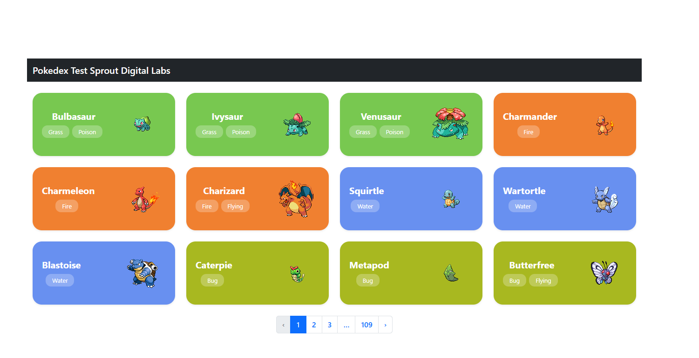
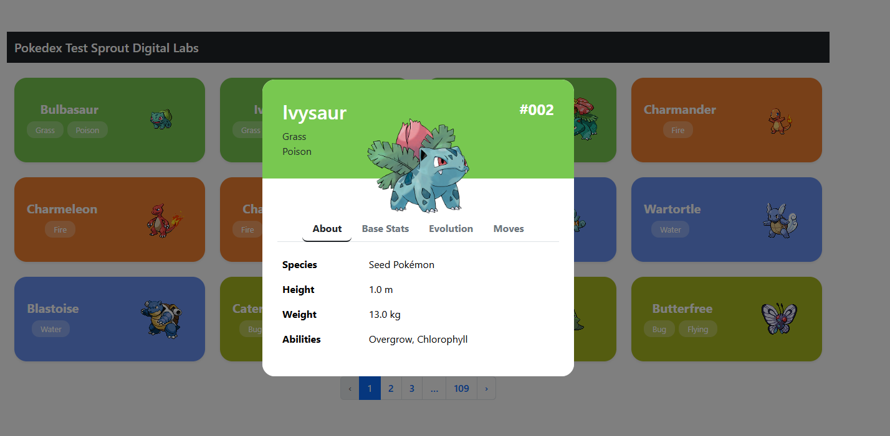
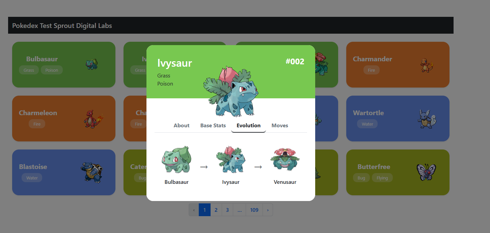
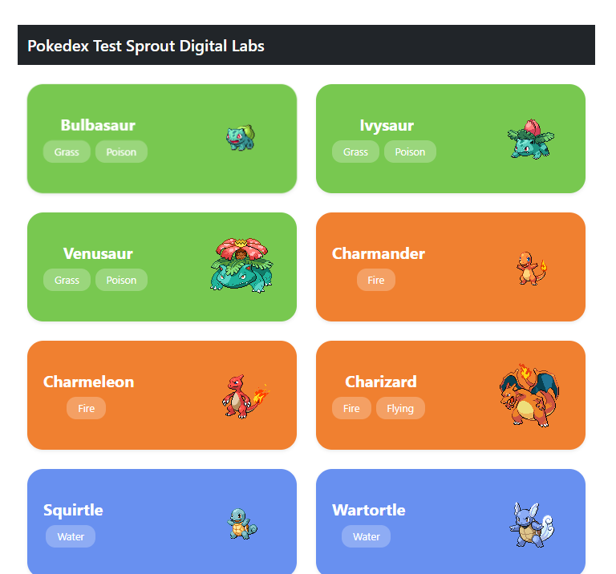

# Pokedex App - Technical Test for Sprout Digital Labs

Aplikasi web Pokedex yang dibangun menggunakan React dan Vite sebagai bagian dari proses _technical test_ untuk **Sprout Digital Labs**. Aplikasi ini menampilkan daftar Pokemon dari PokéAPI dengan fitur paginasi, dan memungkinkan pengguna untuk melihat detail lengkap dari setiap Pokemon melalui jendela modal interaktif.

## Tampilan Aplikasi







---

## ✨ Fitur Utama

-   **Daftar Pokemon**: Menampilkan daftar Pokemon dengan sistem paginasi yang canggih.
-   **Desain Kartu Dinamis**: Setiap kartu Pokemon memiliki warna latar yang sesuai dengan tipe utama Pokemon tersebut.
-   **Tampilan Detail (Modal)**: Mengklik kartu akan membuka jendela modal dengan informasi lengkap tanpa perlu pindah halaman.
-   **Tab Informasi**: Modal detail dilengkapi dengan empat tab informatif:
    -   **About**: Menampilkan informasi dasar seperti spesies, tinggi, berat, dan kemampuan.
    -   **Base Stats**: Menampilkan statistik dasar (HP, Attack, dll.) dengan visualisasi _progress bar_.
    -   **Evolution**: Menampilkan rantai evolusi Pokemon.
    -   **Moves**: Menampilkan semua jurus yang bisa dipelajari.
-   **Desain Responsif**: Tampilan aplikasi sudah dioptimalkan untuk berbagai ukuran layar, dari desktop hingga mobile.

---

## 🛠️ Teknologi yang Digunakan

-   **Framework**: React.js
-   **Build Tool**: Vite
-   **Styling**:
    -   Bootstrap 5
    -   React-Bootstrap
    -   Custom CSS3
-   **API**: [PokéAPI (pokeapi.co)](https://pokeapi.co/)


---

## 🚀 Cara Menjalankan Project

Untuk menjalankan project ini secara lokal, ikuti langkah-langkah berikut:

**1. Clone Repository**
```bash
git clone https://github.com/rakahikmah/Pokedex-ReactJS.git
```
*(Ganti dengan URL repository GitHub Anda)*

**2. Masuk ke Direktori Project**
```bash
cd nama-repository
```

**3. Install Dependencies**
Gunakan `npm` untuk menginstall semua paket yang dibutuhkan.
```bash
npm install
```

**4. Jalankan Server Pengembangan**
Perintah ini akan menjalankan aplikasi dalam mode pengembangan.
```bash
npm run dev
```

**5. Buka di Browser**
Buka browser Anda dan kunjungi [http://localhost:5173](http://localhost:5173) untuk melihat aplikasi berjalan.